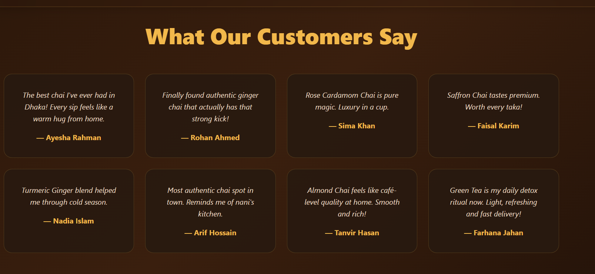

# Chai Order System 🍵

**Premium Django web application for authentic chai lovers**  
Modern, cozy, dark-themed platform to discover handcrafted chai flavors, read real customer stories, and place orders with warmth and elegance.

🔗 Live Demo: https://chai-order-system-5.onrender.com/

  
*Steaming hot chai experience – premium dark UI with golden accents*

---

## ✨ Key Features

- 🌟 Premium dark & warm aesthetic — glassmorphism cards, golden highlights, subtle chai-inspired textures  
- 🖼️ Responsive product showcase — 20+ handcrafted chai flavors with prices, discounts, ratings & badges  
- 🛒 **Order Now** flow — clean, backend-ready ordering experience  
- 💬 Heartfelt customer testimonials with elegant staggered animations  
- 📩 Professional contact form (validation-ready)  
- 📱 Fully responsive & mobile-first design  
- ⚡ Smooth, lightweight animations using pure CSS + Intersection Observer  
- 🐍 Clean Django project structure — no heavy frontend frameworks

---

## 🖼️ Screenshots

<table>
<tr>
<td><strong>Landing Page</strong><br></td>
<td><strong>About Section</strong><br></td>
</tr>
<tr>
<td><strong>Signature Flavors</strong><br></td>
<td><strong>Testimonials</strong><br></td>
</tr>
</table>

---

## 🛠️ Tech Stack

| Layer         | Technology                              | Notes                                    |
|---------------|-----------------------------------------|------------------------------------------|
| Backend       | Django 4.2+                             | REST-ready structure                     |
| Frontend      | HTML5, CSS3, Vanilla JavaScript         | No external UI libraries                 |
| Styling       | Pure CSS (glassmorphism, gradients)     | Custom design, no Tailwind/Bootstrap     |
| Animations    | CSS + Intersection Observer             | Lightweight & performant                 |
| Fonts         | System fonts (Segoe UI, system-ui)      | Fast loading                             |
| Images        | Optimized static files                  | Lazy loading supported                   |
| Deployment    | Render / similar PaaS                   | Live at: https://chai-order-system-5.onrender.com |

---

## 🚀 Quick Start

### 1. Clone the repository

```bash
git clone https://github.com/Sharatpsd/chai-order-system.git
cd chai-order-system
